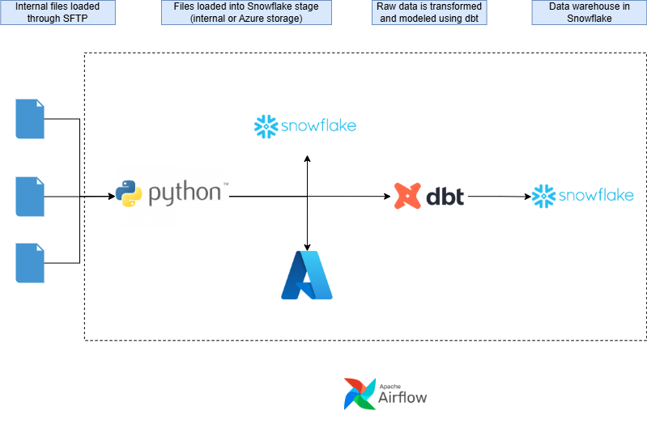
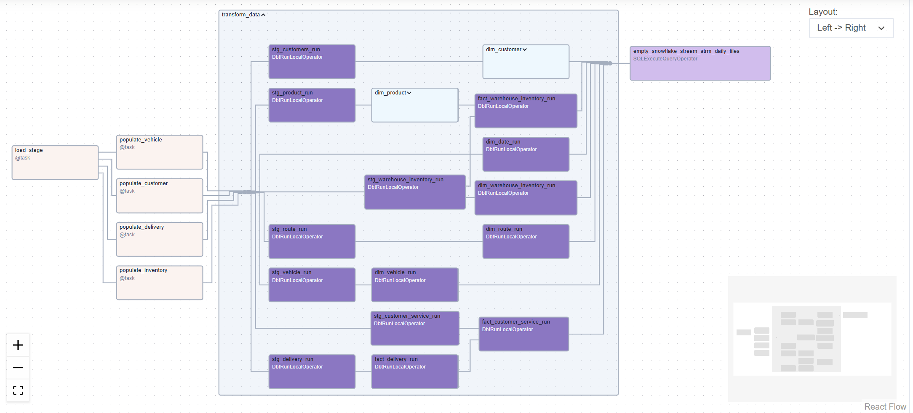

# Snowflake Warehouse from Local CSV Files

This project demonstrates a complete data warehouse built using **Python**, **Snowpark**, **dbt**, **Snowflake**, **Snowflake AI**, and **Airflow**. The data originates from four local CSV files, which are loaded, cleaned, transformed, and orchestrated using the tools listed above.

---

## Data Loading

The first step is to load the CSV files into a location accessible to Snowflake.  
For this project, an **internal Snowflake stage** is used. The original intention was to store the files in an **Azure Storage Account**, as this is generally a more cost-effective option for large volumes of data.

Python code to load data into azure storage account:
[load_to_container.py](include/python_codes/load_to_container.py)

New incoming files are detected using a **Snowflake stream** configured with an *append-only* filter. The files are then loaded into the raw tables using **Snowpark**, where some initial data cleaning is performed to ensure the data is ready for later processing.

I consider it good practice to retain all raw files so that the pipeline can be replayed if necessary. Therefore, all files remain stored in the stage for future reference.

---

## Transformations with dbt

All transformations are handled using **dbt**.  
The dbt project includes several tests designed to flag anomalies and ensure the reliability of the data.

A key model in this project is:
[dim_vehicle.sql](dbt/dbt_project/models/prod/dim_vehicle.sql)

This model implements a combination of **incremental processing** and **Slowly Changing Dimensions (SCD)**.  
Using a mix of SQL and Jinja, the model detects and captures changes efficiently. The logic is highly reusable—other models can adopt the same pattern by adjusting the configuration and the Jinja variables at the top of the file. This approach could also be extracted into a custom dbt materialisation if desired.

I chose this technique instead of dbt snapshots, as snapshots require storing data in two separate locations, which was unnecessary for this project.

The project also uses **Snowflake AI** to transform several free-text fields into categorical values, making the dataset easier to analyse.

---

## Orchestration with Airflow

All components of the project are orchestrated using **Airflow**, deployed through the **Astro CLI**.  
Below is the full DAG showing the workflow and all tasks involved:

---

## Future Improvements

Future improvements include:

- Storing all credentials securely in **Azure Key Vault**, **GitHub Secrets**, or a similar secure service  
- Replacing password-based authentication with **MFA**  
- Using **private key authentication** for both dbt and Airflow when connecting to Snowflake
- Clean dbt project
- Clean airflow dag 

---